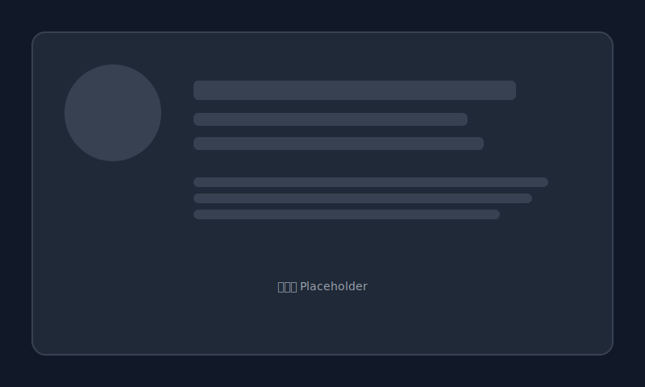

# DemoX：把页面最快交付出去的方式

DemoX 是一个真正能用的静态网站托管与发布平台。无需服务器、无需 CDN 配置、无需运维知识——只要你有前端构建产物，就能在几分钟之内给任何人一个能打开的链接。

## 它到底能帮你做什么？

- 上传一个 zip 包，立刻得到公网链接
- 默认启用 HTTPS 与 CDN 加速，速度与稳定性兼顾
- 自动缓存策略：HTML 实时更新、静态资源长期缓存
- 服务端鉴权与限额控制，不担心误用与乱用
- 随时下线、清理、重部署，发布节奏更自由

## 适合谁？

- 前端开发者要给老板/客户看页面
- 做活动页、落地页、作品集、Demo
- 独立开发者快速验证想法
- 团队内部需要预览与评审链接

一句话：只要你现在就需要一个能打开的链接，它就合适。

## 为什么更省事？

- 不用学对象存储，不用研究 CDN，不用管 HTTPS
- 不需要写部署脚本，不需要维护服务器
- 不会被各种零碎配置与奇怪错误拖慢
- 平台已经把“运维层的麻烦事”打包解决了

## 稳定性与安全性（你可以放心用）

- 发布、删除、重发布都在服务端完成
- 站点按用户与项目隔离
- 上传内容有安全审核
- 阻止目录穿越与非法结构

这不是玩具，而是可以长期使用的服务。

## 怎么用（超短版本）

1. 本地把前端项目构建好，得到 dist/
2. 打包为 zip
3. 上传到平台
4. 获得链接，发给任何人

就是这么简单。

## 这不是 CI/CD 的替代

把复杂流水线交给需要它的人。DemoX 专注解决“快速交付”的问题：当你只想把页面给别人看，它是最快的路径。

## 一句话总结

如果你的目标是“尽快拿到一个能打开的链接”，那就用它。

